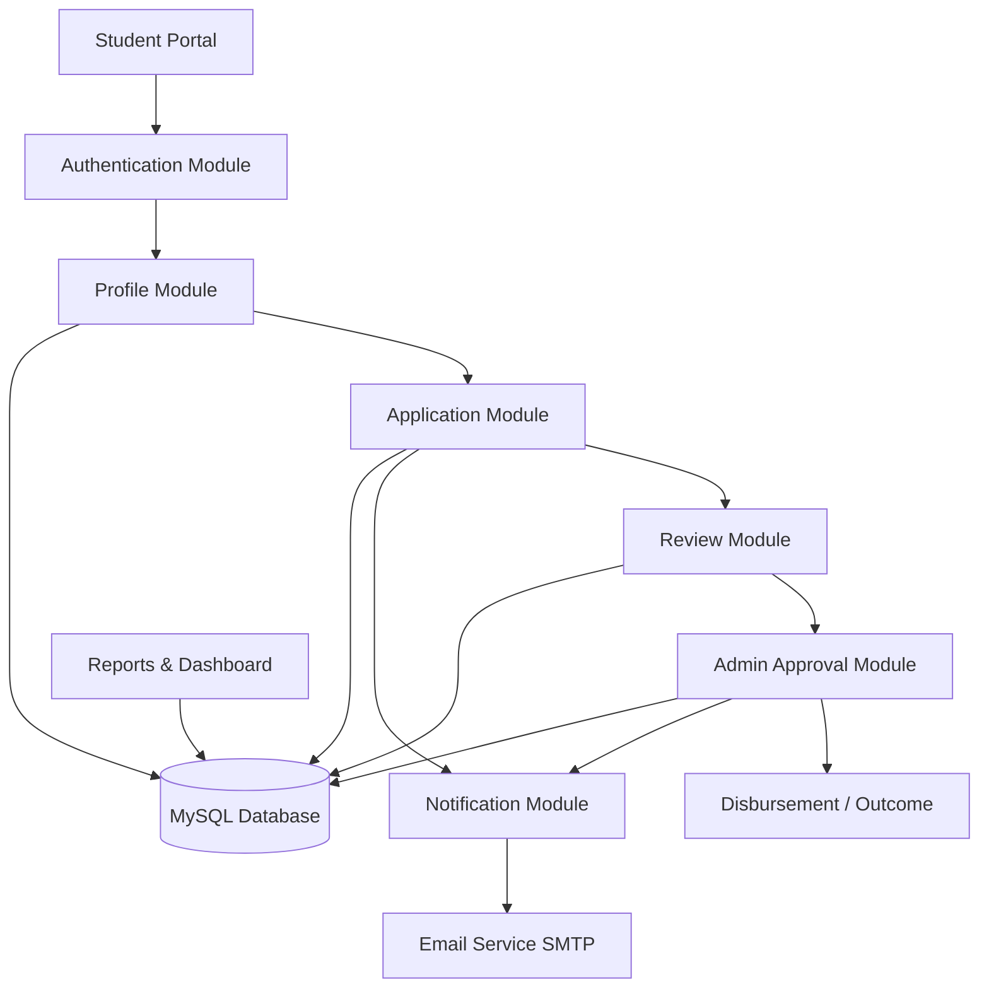

# BURSARY MANAGEMENT SYSTEM - PROPOSAL PRESENTATION (FINAL 7-SLIDE FIT)

Use this version directly in PowerPoint. Each slide is trimmed to fit without overcrowding.

## SLIDE 1: TITLE
- **Project Title:** Matungu Constituency Bursary Management System
- **By:** [Your Name]
- **Major:** [Your Course Major]
- **Supervisor:** [Supervisor's Name]

## SLIDE 2: INTRODUCTION AND SCOPE
**Introduction**
- This project digitizes the bursary process from application to approval and reporting.
- It reduces paperwork delays, improves transparency, and strengthens communication with students.
- The system provides role-based access for Students, Reviewers, and Admin.

**Scope**
- Online student registration, profile management, and document upload.
- Bursary application submission, tracking, review, approval/rejection.
- School and ward-based data management.
- Email notifications and basic analytics/reporting dashboard.

## SLIDE 3: PROBLEM STATEMENT
- Current bursary processes are mostly manual and slow.
- Paper records are hard to track and easy to lose.
- Students lack clear visibility of application status.
- Communication on approval/rejection is delayed.
- Reporting for decisions and audits is difficult.

## SLIDE 4: OBJECTIVES
1. Build a secure online bursary application platform.
2. Automate review and approval workflows.
3. Organize schools by category and wards.
4. Send timely status updates by email.
5. Provide reports for bursary monitoring and decisions.

## SLIDE 5: CONCEPTUAL DIAGRAM / SYSTEM MODEL
Copy this flowchart into a Mermaid-enabled tool and export as PNG/SVG for PowerPoint.

**Short explanation (put below diagram):**
- Students submit applications through the portal.
- Reviewers assess applications; Admin gives final decision.
- All modules read/write to MySQL.
- Notification module sends automatic email updates.

## SLIDE 6: TOOLS TO BE USED
**Programming Languages**
- Python, JavaScript, HTML, CSS, SQL

**Software**
- Visual Studio Code, MySQL, Git/GitHub, Chrome/Edge

**Technologies**
- Django, PyMySQL, SMTP Email, Bootstrap/Custom CSS

## SLIDE 7: FUNCTIONALITY / HOW SYSTEM WORKS / MODULES
1. User signs up, logs in, and completes profile.
2. Student fills bursary form and uploads required documents.
3. Application is stored and marked `Pending`.
4. Reviewer evaluates and forwards recommendation.
5. Admin approves or rejects application.
6. Email notification is sent automatically to the student.
7. Dashboard updates counts and report metrics in real time.

## QUICK FORMAT GUIDE (FOR CLEAN SLIDES)
- Use at most 5-7 bullets per slide.
- Keep each bullet to one line where possible.
- Font suggestion: Title 36-44 pt, body 22-28 pt.
- On Slide 5, use only the diagram + 3 short explanation bullets.
