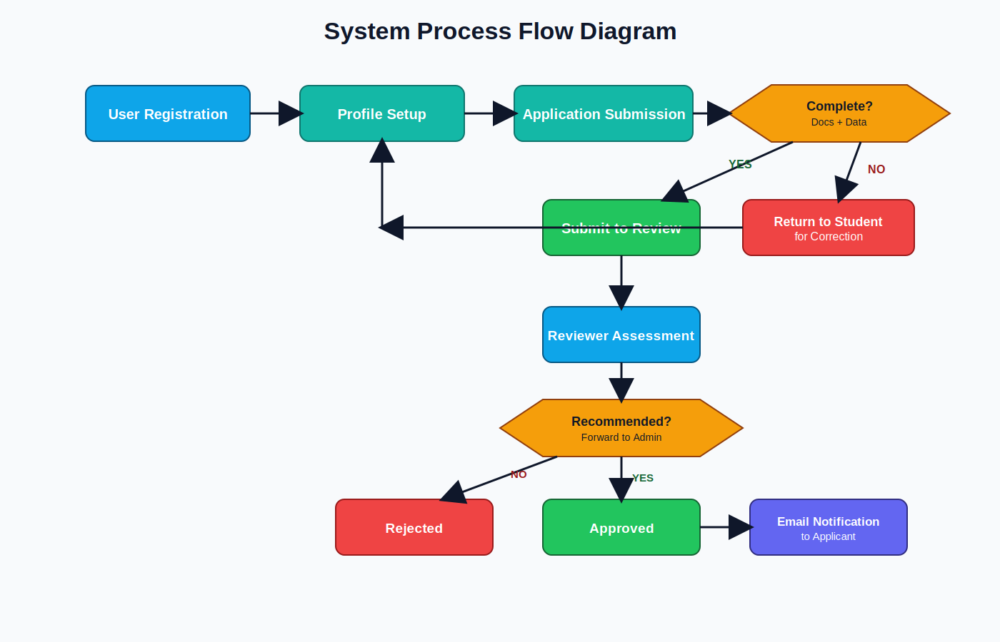
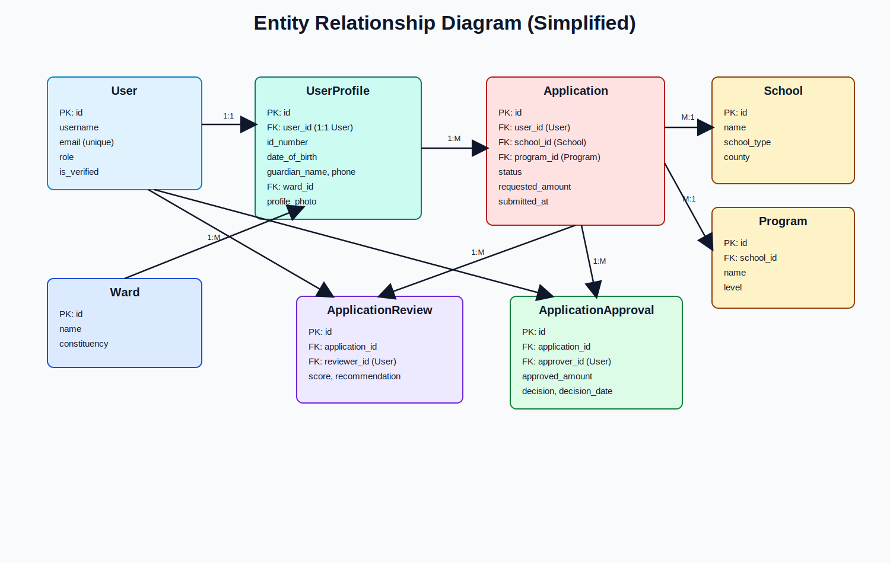
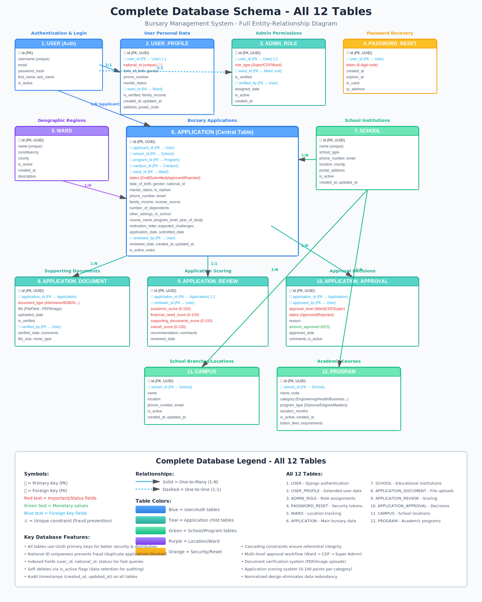
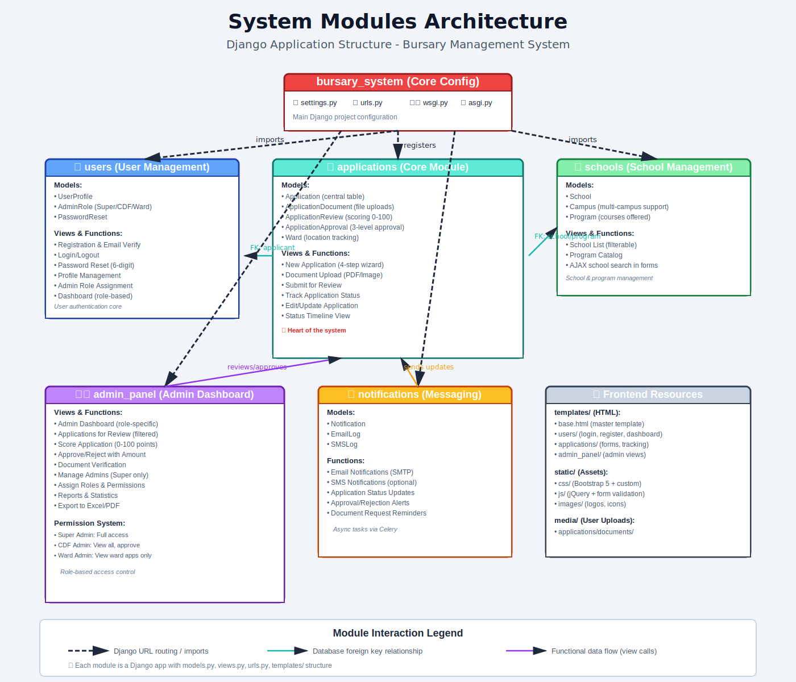
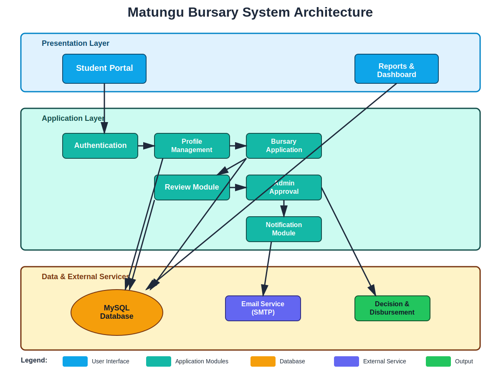

# PROJECT PROPOSAL
## Matungu Constituency Bursary Management System

**Prepared by:** [Your Name]  
**Registration Number:** [Your Reg No.]  
**Course / Major:** [Your Course Major]  
**Supervisor:** [Supervisor Name]  
**Institution:** [Institution Name]  
**Date:** March 2026

---

## 1. Introduction
Access to education funding is a major challenge for many students in Matungu Constituency. The current bursary process relies heavily on manual forms and office-based workflows, which causes delays, missing records, and low transparency for applicants.

This proposal presents a web-based **Bursary Management System** that digitizes the full process: student registration, profile management, bursary application, review, approval/rejection, communication, and reporting. The proposed system is built to improve service delivery, accountability, and data-driven decision-making in bursary allocation.

---

## 2. Background and Problem Statement
The existing bursary administration process has several operational weaknesses:
- Manual paper records are difficult to track and audit.
- Applicants do not receive timely status updates.
- Review and approval cycles are slow and inconsistent.
- Generating reports for management and oversight is difficult.
- There is no centralized digital repository for applications and supporting documents.

These limitations reduce efficiency, increase administrative workload, and affect fairness and transparency in bursary allocation.

---

## 3. Project Justification
The proposed system will:
- Reduce processing time through automated workflows.
- Improve transparency with status tracking and notifications.
- Improve data integrity with centralized MySQL storage.
- Support accountability through audit-ready records.
- Improve user experience for students and staff.

---

## 4. Objectives
### 4.1 General Objective
To design and implement a secure web-based bursary management system for efficient, transparent, and accountable bursary administration.

### 4.2 Specific Objectives
1. Develop student registration, login, and profile modules.
2. Implement online bursary application and document upload.
3. Implement reviewer and admin decision workflows.
4. Integrate email notifications for process updates.
5. Provide dashboard and reporting capabilities for administrators.

---

## 5. Scope of the Project
### 5.1 In Scope
- User account management (Student, Reviewer, Admin roles).
- Student profile management with supporting details.
- Bursary application creation, editing, submission, and tracking.
- Document uploads linked to applications.
- Review scoring and recommendation.
- Admin approval/rejection and disbursement recording.
- Notification delivery via email.
- Reporting and dashboard statistics.
- School, ward, and program data management.

### 5.2 Out of Scope (Current Phase)
- Mobile app version.
- Integration with national payment gateways.
- SMS gateway integration.
- AI-based automatic eligibility scoring.

---

## 6. Methodology
The project follows an iterative development approach:
1. Requirements collection and validation with stakeholders.
2. System analysis and data modeling.
3. UI and architecture design.
4. Backend and database implementation (Django + MySQL).
5. Module integration and functional testing.
6. User testing and refinement.
7. Documentation and handover.

---

## 7. Proposed System Overview
The system is a web platform built on Django framework with MySQL as the data layer. It supports role-based workflows:
- **Students** create applications and track progress.
- **Reviewers** assess and recommend decisions.
- **Admins** approve/reject and manage operational data.

---

## 8. Functional Requirements
- User registration, authentication, and password reset.
- Profile creation with guardian and location data.
- Bursary application with multi-step submission.
- Upload and store supporting documents.
- Review and recommendation workflow.
- Approval/rejection and disbursement processing.
- Email notifications on status changes.
- Dashboard analytics and report generation.

---

## 9. Non-Functional Requirements
- **Security:** role-based access, password hashing, CSRF protection.
- **Usability:** responsive and accessible interface.
- **Reliability:** consistent transaction handling in MySQL.
- **Performance:** efficient query operations and page rendering.
- **Maintainability:** modular Django app structure.

---

## 10. Tools and Technologies
- **Programming:** Python, JavaScript, HTML, CSS, SQL
- **Framework:** Django 6.x
- **Database:** MySQL 8.x
- **DB Driver:** PyMySQL
- **Version Control:** Git/GitHub
- **IDE:** Visual Studio Code
- **Email:** SMTP integration

---

## 11. System Modules and How They Interconnect
1. **Users Module:** manages registration, login, roles, and profile.
2. **Applications Module:** captures bursary details and application status.
3. **Schools Module:** stores schools, programs, and wards.
4. **Review Module:** supports review scoring and recommendations.
5. **Approval Module:** final decision and disbursement information.
6. **Notifications Module:** sends application updates via email.
7. **Dashboard/Reports Module:** provides analytics and summaries.

Interconnection summary:
- User actions create/update applications.
- Applications trigger reviewer workflows.
- Review outcomes trigger admin decisions.
- Status changes trigger notifications.
- All transactions are persisted to MySQL and reflected on dashboard metrics.

---

## 12. Required Diagrams

### 12.1 Use Case Diagram

### 12.2 System Process Flow Diagram

### 12.3 Entity Relationship Diagram (Simplified)

### 12.4 Detailed Database Schema

### 12.5 System Modules Diagram

### 12.6 System Architecture Diagram

---

## 13. Expected Outputs
- Fully functional web-based bursary management system.
- Reduced processing time and paperwork.
- Improved transparency through applicant status tracking.
- Reliable database for records, reporting, and audits.
- Improved communication between office and applicants.

---

## 14. Risks and Mitigation
- **Risk:** Low user adoption.  
  **Mitigation:** onboarding and user training.
- **Risk:** Incomplete application data.  
  **Mitigation:** mandatory field validation and document checks.
- **Risk:** Email delivery failure.  
  **Mitigation:** SMTP monitoring and retry process.
- **Risk:** Data security issues.  
  **Mitigation:** access controls, secure password policies, backups.

---

## 15. Detailed Implementation Schedule and Timeline

### 15.1 Project Duration
Planned duration: **20 weeks** (approximately 5 months)

### 15.2 Work Breakdown and Schedule Table
| Phase | Activities | Duration | Timeline (Week) | Deliverables | Owner |
|---|---|---|---|---|---|
| Phase 1: Initiation | Project charter, scope confirmation, stakeholder mapping | 2 weeks | W1-W2 | Approved project charter | Project Manager |
| Phase 2: Requirements | Interviews, process mapping, requirement specification | 3 weeks | W3-W5 | SRS document | BA/PM |
| Phase 3: Design | UI mockups, architecture, database design, API design | 3 weeks | W6-W8 | Design pack and ERD | System Analyst/Dev |
| Phase 4: Development Sprint 1 | User module, profile module, school/ward data module | 3 weeks | W9-W11 | Core user features | Dev Team |
| Phase 5: Development Sprint 2 | Application, review, approval, notifications module | 4 weeks | W12-W15 | Full process workflow | Dev Team |
| Phase 6: Testing | Unit, integration, UAT, security and performance checks | 2 weeks | W16-W17 | Test report and bug log | QA/Users |
| Phase 7: Deployment | Environment setup, migration, production deployment | 1 week | W18 | Live system | DevOps/PM |
| Phase 8: Training and Handover | User training, admin training, manuals, sign-off | 2 weeks | W19-W20 | Go-live acceptance | PM/Sponsor |

### 15.3 Milestones
| Milestone | Target Week | Success Criteria |
|---|---|---|
| M1: Charter Approval | W2 | Sponsor signs project charter |
| M2: Requirements Sign-off | W5 | SRS approved by supervisor and stakeholders |
| M3: Design Sign-off | W8 | Architecture and UI approved |
| M4: Feature Complete | W15 | All planned modules implemented |
| M5: UAT Pass | W17 | Critical defects closed |
| M6: Go-Live | W18 | Production deployment successful |
| M7: Final Acceptance | W20 | Supervisor and sponsor sign handover |

---

## 16. Budget Estimate (Assuming Real Project)

### 16.1 Budget Assumptions
- Currency: **Kenyan Shillings (KES)**
- Team: 1 PM, 2 Developers, 1 QA, part-time UI/UX support
- Timeline: 5 months implementation + 12 months support window

### 16.2 Cost Breakdown Table
| Cost Category | Description | Unit Cost (KES) | Qty/Months | Total (KES) |
|---|---|---:|---:|---:|
| Project Management | PM allowance | 90,000 | 5 | 450,000 |
| Backend Development | Python/Django developer | 120,000 | 5 | 600,000 |
| Frontend Development | UI integration and templates | 90,000 | 5 | 450,000 |
| QA and Testing | Test planning and execution | 70,000 | 3 | 210,000 |
| UI/UX Support | Design refinement and usability tests | 60,000 | 2 | 120,000 |
| Infrastructure | Hosting/VPS + domain + SSL (annual) | 120,000 | 1 | 120,000 |
| Email Service | SMTP/transactional email setup | 36,000 | 1 | 36,000 |
| Security and Backup | Backup storage and hardening | 60,000 | 1 | 60,000 |
| Training and Change Management | User/admin training and materials | 80,000 | 1 | 80,000 |
| Documentation | Technical/user manuals | 45,000 | 1 | 45,000 |
| Contingency (10%) | Risk reserve | - | - | 217,100 |
| **Grand Total** |  |  |  | **2,388,100** |

### 16.3 Operational Cost (Post Go-Live, Annual)
| Item | Annual Cost (KES) |
|---|---:|
| Hosting and maintenance | 180,000 |
| Email and communication services | 60,000 |
| Support and minor enhancements | 300,000 |
| Backup and monitoring | 60,000 |
| **Total Annual OPEX** | **600,000** |

---

## 17. Project Governance and Team Structure

### 17.1 Governance Structure
- **Project Sponsor:** Constituency bursary office leadership
- **Supervisor:** Academic/technical oversight
- **Project Manager:** Planning, scheduling, reporting, risk control
- **Technical Lead:** System architecture and code quality
- **QA Lead:** Testing strategy and quality gates

### 17.2 Role Matrix (RACI - Summary)
| Deliverable | Sponsor | Supervisor | PM | Dev Team | QA | Users |
|---|---|---|---|---|---|---|
| Requirements approval | A | C | R | C | C | C |
| System design | C | A | R | R | C | I |
| Development | I | C | C | R | C | I |
| Testing and UAT | I | C | R | C | R | R |
| Deployment and handover | A | C | R | R | R | C |

Legend: R = Responsible, A = Accountable, C = Consulted, I = Informed

---

## 18. Communication and Reporting Plan
| Audience | Information | Frequency | Channel | Owner |
|---|---|---|---|---|
| Sponsor | Progress, budget, risks | Bi-weekly | Review meeting + report | PM |
| Supervisor | Technical and academic progress | Weekly | Email + meeting | PM/Tech Lead |
| Team | Tasks, blockers, sprint updates | Daily | Stand-up/Teams/WhatsApp | PM |
| End Users | UAT and training updates | As needed | Workshops/Notices | PM/Trainer |

---

## 19. Quality Management Plan

### 19.1 Quality Objectives
- Zero critical defects at go-live.
- At least 95% test pass rate before deployment.
- System uptime target of 99% in production.

### 19.2 Quality Assurance Activities
- Code reviews and branch quality checks.
- Unit and integration tests for all core modules.
- UAT with bursary office staff and selected students.
- Security checks for authentication and data protection.

---

## 20. Risk Register (Expanded)
| Risk | Probability | Impact | Response Strategy | Owner |
|---|---|---|---|---|
| Scope creep | Medium | High | Change control board and signed change requests | PM |
| Delayed approvals | Medium | Medium | Early review windows and escalation path | Sponsor/PM |
| Technical debt | Medium | High | Coding standards and weekly code review | Tech Lead |
| Data migration issues | Low | High | Pilot migration and rollback plan | Dev/DBA |
| User resistance | Medium | Medium | Early training and champion users | PM |
| Security breach | Low | High | Access controls, backups, patching, audit logs | Tech Lead |

---

## 21. Procurement and Resource Plan
- Development laptops/workstations.
- Hosting environment (staging + production).
- Domain name and SSL certificate.
- Backup storage and monitoring tools.
- Optional paid SMTP provider for higher delivery reliability.

---

## 22. Change Management and Training Plan
- Conduct role-based training: Students, Reviewers, Admin.
- Provide user guides and quick reference sheets.
- Run pilot in one ward before full rollout.
- Collect feedback and implement priority fixes.
- Formal sign-off after acceptance testing.

---

## 23. Monitoring and Evaluation (M&E)
| KPI | Baseline | Target After Go-Live |
|---|---|---|
| Average application processing time | 4-8 weeks | 1-2 weeks |
| Status inquiry visits/calls | High | Reduce by 60% |
| Lost/missing application records | Frequent | Near zero |
| User satisfaction score | Not measured | >= 80% |
| Report generation time | Several days | < 30 minutes |

---

## 24. Acceptance Criteria
Project will be accepted when:
1. All in-scope modules are delivered and tested.
2. UAT is signed off by authorized users.
3. Supervisor validates technical documentation.
4. Production deployment is stable for at least 2 weeks.
5. Training and handover are completed.

---

## 25. Conclusion
The proposed Matungu Constituency Bursary Management System addresses key operational gaps by digitizing end-to-end bursary workflows. With clear budget planning, practical timelines, governance controls, and measurable success indicators, this proposal is positioned for real-world implementation and sustainable operation.

---

## 26. Supervisor Approval Section
**Supervisor Comments:**  
.........................................................................................................................  
.........................................................................................................................  

**Supervisor Name:** _______________________________  
**Signature:** _____________________________________  
**Date:** _________________________________________
