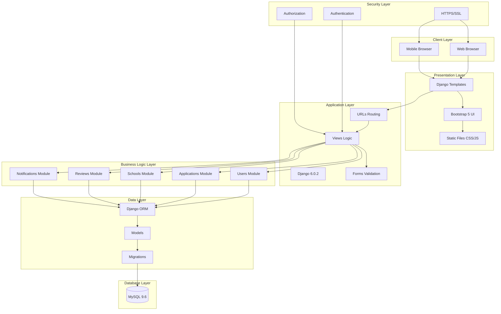
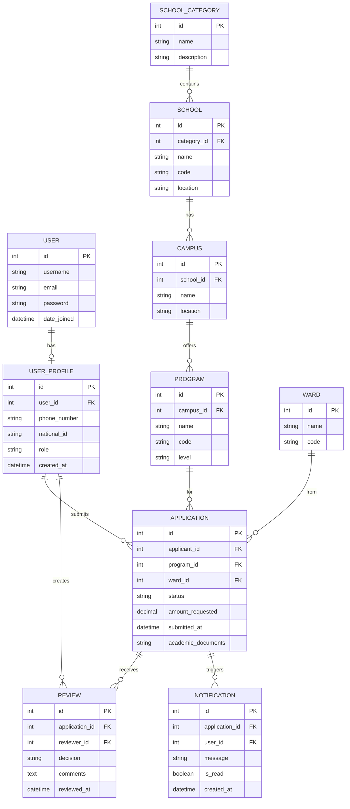
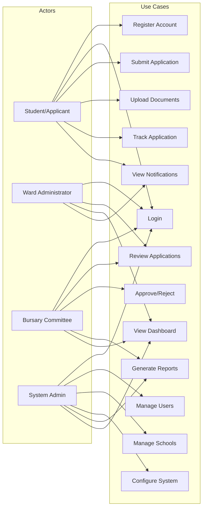
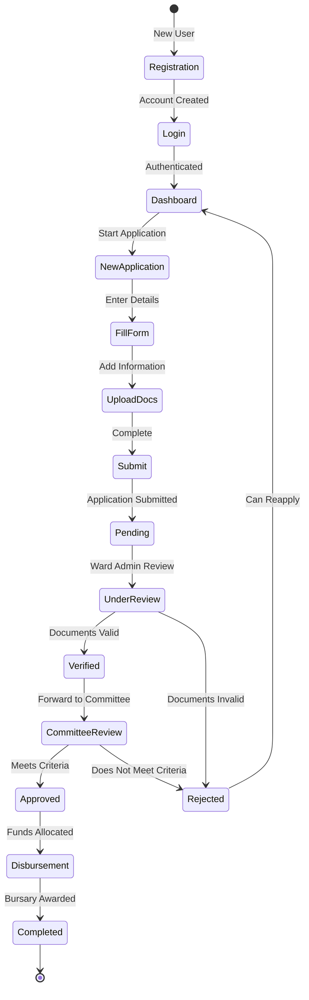
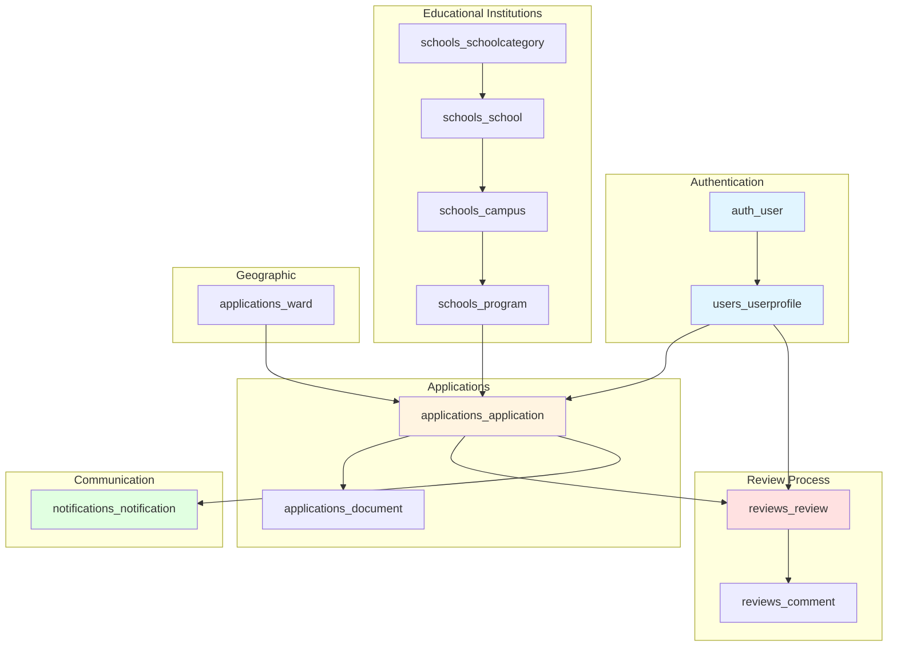

# System Diagrams

## Figure 3.1: System Architecture Diagram

---

## Figure 3.2: Entity-Relationship Diagram

---

## Figure 3.3: Use Case Diagram

---

## Figure 1.1: Bursary Application Workflow

---

## Figure 3.4: Database Schema Overview

---

## How to Use These Diagrams

### In Markdown/PDF:
These diagrams are written in Mermaid syntax and will render automatically in:
- GitHub (in README files)
- VS Code (with Mermaid extension)
- Many Markdown-to-PDF converters

### For Word/PowerPoint:
1. Open this file in VS Code
2. Install "Markdown Preview Mermaid Support" extension
3. Right-click on the diagram and "Copy as Image"
4. Paste into your document

### Online Rendering:
Visit https://mermaid.live/ and paste any diagram code to get a PNG/SVG export.
